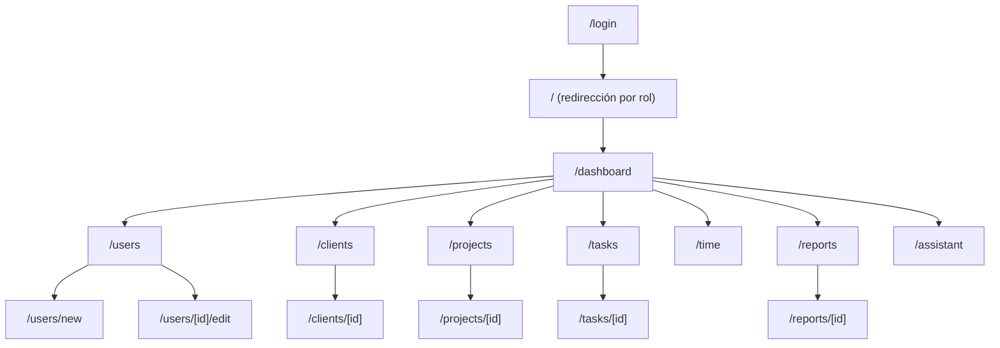
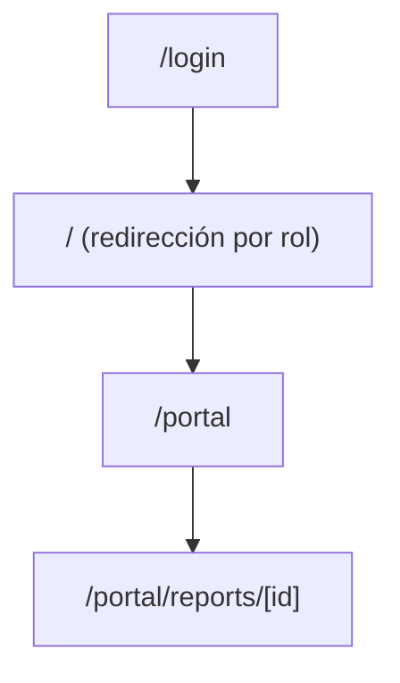
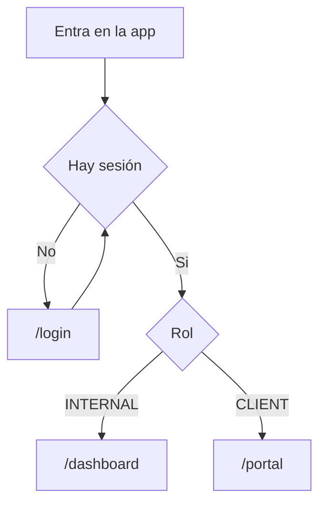
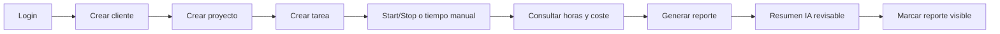
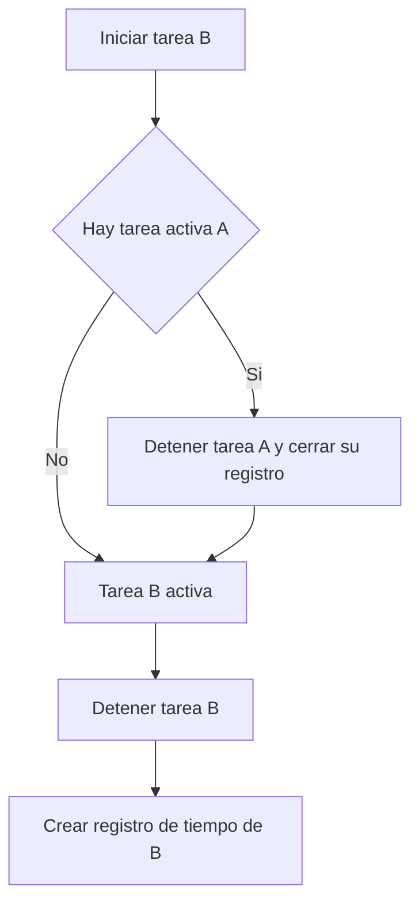
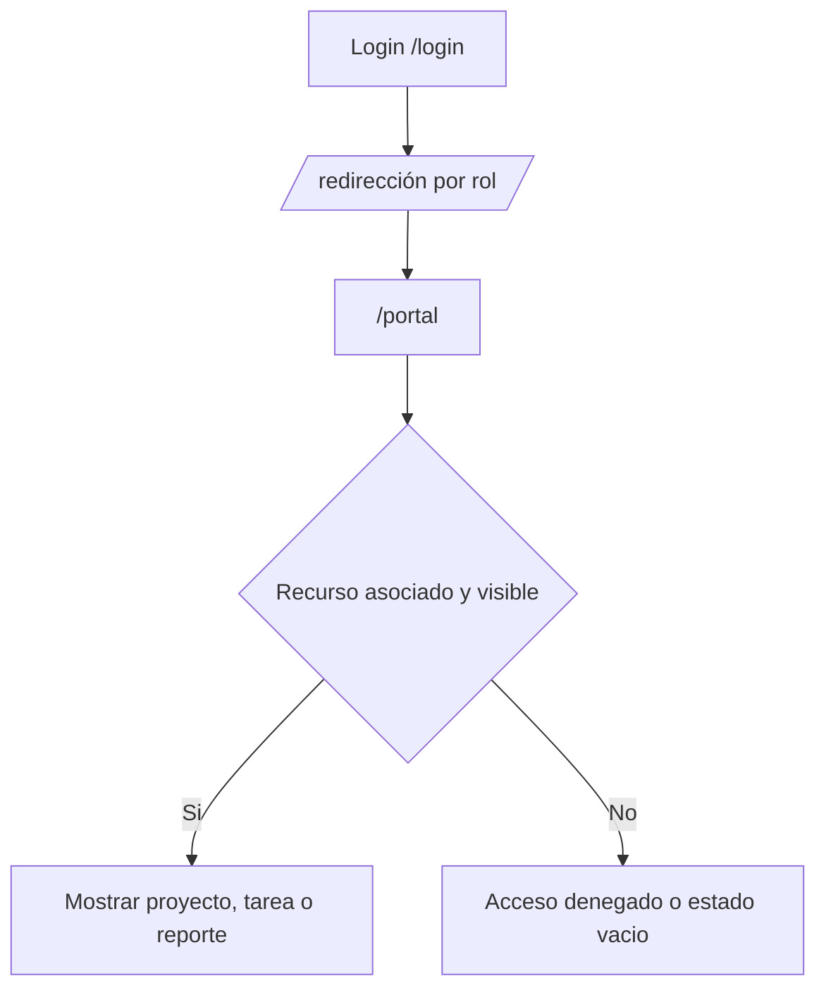

# Pantallas y navegación

> Documento funcional/UX del MVP del TFM.
> Define el inventario de pantallas, su contenido y los flujos de navegación, partiendo de los casos de uso de `docs/10-casos-de-uso.md`.

## 1. Introducción

Este documento describe las pantallas del MVP y cómo se navega entre ellas.

Sirve de puente entre los casos de uso (`docs/10-casos-de-uso.md`) y la implementación de la interfaz, reutilizando la UI base ya creada en `src/components/` (ver `docs/notas/19-explicacion-ui-base-reutilizable.md`).

El diseño de acceso (login propio) y de la gestión de usuarios (rutas CRUD separadas) sigue las decisiones del diagnóstico `docs/notas/21-diagnostico-login-users.md` y el `docs/adr/0008-login-y-estructura-usuarios.md`.

No define acabado visual final, sistema de diseño completo ni maquetación definitiva. Describe propósito, contenido funcional, estados y navegación dentro del alcance del MVP.

El campo **Estado** de cada pantalla refleja la situación real del repositorio (`Implementado`, `Parcial`, `Pendiente`) y no presenta como hecho lo que no existe.

## 2. Convención

- Las **rutas** siguen el App Router de Next.js (`src/app/...`).
- Las pantallas internas se sirven dentro del layout común `AppShell` (`src/components/layout/`).
- Cada pantalla indica: ruta, rol con acceso, casos de uso que soporta, estado, propósito, contenido, acciones, estados de UI y reglas de visibilidad.
- Los **estados de UI** comunes se definen en la sección 6 y no se repiten en detalle por pantalla.

## 3. Inventario de pantallas

| Ruta | Pantalla | Rol | CU | Estado |
|---|---|---|---|---|
| `/login` | Inicio de sesión | Público | CU-01 | Implementado |
| `/` | Redirección por rol | Autenticado | CU-01 | Implementado |
| `/dashboard` | Panel interno (en construcción) | `INTERNAL` | — | Implementado (placeholder) |
| `/users` | Usuarios — listado | `ADMIN`+ | CU-02 | Implementado |
| `/users/new` | Usuarios — alta | `ADMIN`+ | CU-02 | Implementado |
| `/users/[id]/edit` | Usuarios — edición | `ADMIN`+ | CU-02 | Implementado |
| `/clients` | Listado de clientes | `INTERNAL` | CU-03 | Pendiente |
| `/clients/[id]` | Ficha de cliente | `INTERNAL` | CU-03 | Pendiente |
| `/projects` | Listado de proyectos | `INTERNAL` | CU-04 | Pendiente |
| `/projects/[id]` | Ficha de proyecto | `INTERNAL` | CU-04 | Pendiente |
| `/tasks` | Listado de tareas | `INTERNAL` | CU-05 | Pendiente |
| `/tasks/[id]` | Ficha de tarea (tiempos y start/stop) | `INTERNAL` | CU-05, CU-06, CU-07 | Pendiente |
| `/time` | Panel de tiempos / tarea activa | `INTERNAL` | CU-07, CU-08 | Pendiente |
| `/reports` | Listado y generación de reportes | `INTERNAL` | CU-08, CU-09 | Pendiente |
| `/reports/[id]` | Vista de reporte (con resumen IA) | `INTERNAL` | CU-09, CU-10 | Pendiente |
| `/assistant` | Prueba de lenguaje natural | `INTERNAL` | CU-12 | Pendiente |
| `/portal` | Área de cliente (en construcción) | `CLIENT` | CU-11 | Implementado (placeholder) |
| `/portal/reports/[id]` | Reporte visible para cliente | `CLIENT` | CU-11 | Pendiente |

> `/api/auth/*` es el manejador de Auth.js/NextAuth (no es una pantalla); la interfaz de acceso será la pantalla propia `/login`.
> Las rutas pendientes son una propuesta coherente con el alcance del MVP y podrán ajustarse durante la implementación de cada módulo.

## 4. Mapa de pantallas (sitemap)

> El acceso (login propio, redirección por rol) y la gestión de usuarios (rutas CRUD) ya están implementados según `docs/adr/0008`. Las rutas de los módulos de negocio (clientes, proyectos, tareas, tiempos, reportes, asistente) y el contenido real de `/dashboard` y `/portal` siguen pendientes (ver columna Estado en la sección 3).

### 4.1. Área interna (`INTERNAL`)

### 4.2. Área de cliente (`CLIENT`)

## 5. Ficha por pantalla

### 5.1. Inicio de sesión — `/login`

- **Rol**: público. **CU**: CU-01. **Estado**: Implementado.
- **Propósito**: autenticar al usuario y resolver su rol mediante una pantalla propia.
- **Contenido**: formulario de email y contraseña que invoca `signIn` de Auth.js.
- **Acciones**: iniciar sesión.
- **Estados**: error de credenciales (mensaje genérico); usuario inactivo (acceso denegado).
- **Notas**: pantalla propia `/login` con `pages.signIn = "/login"`; tras autenticar, la navegación se resuelve en `/` por rol (ver 5.2).

### 5.2. Redirección por rol — `/`

- **Rol**: autenticado. **CU**: CU-01. **Estado**: Implementado.
- **Propósito**: entrada de la aplicación; no muestra contenido propio, redirige.
- **Comportamiento**: sin sesión → `/login`; con sesión → `/dashboard` si el rol es `INTERNAL`, `/portal` si es `CLIENT` (`src/app/page.tsx`).

### 5.3. Panel interno — `/dashboard`

- **Rol**: `INTERNAL`. **CU**: —. **Estado**: Implementado (placeholder).
- **Propósito**: destino tras login para usuarios internos y, a futuro, panel de inicio con accesos a las secciones.
- **Contenido**: página simple "dashboard en construcción" dentro del `AppShell`, con la navegación interna y el logout.
- **Pendiente**: contenido real del panel (accesos rápidos, resúmenes); fuera del alcance de este rework.

### 5.4. Usuarios — `/users`, `/users/new`, `/users/[id]/edit`

- **Rol**: `INTERNAL`. **CU**: CU-02. **Estado**: Implementado.
- **Propósito**: administrar usuarios básicos del MVP con un patrón CRUD reutilizable.
- **`/users` (listado)**: cabecera (`PageHeader`), tabla de usuarios (`Table` de shadcn) con rol y estado (`Badge`), y acciones por fila (editar, activar/desactivar) y acceso a alta.
- **`/users/new` (alta)**: formulario de creación.
- **`/users/[id]/edit` (edición)**: formulario de edición, incluido cambio de estado y de contraseña opcional.
- **Campos**: nombre, email, rol (`INTERNAL`/`CLIENT`), estado (`ACTIVE`/`INACTIVE`), cliente asociado, contraseña inicial / nueva.
- **Acciones**: crear, editar, activar/desactivar.
- **Validaciones**: email único; contraseña mínima 8 caracteres; creación de `CLIENT` condicionada a que exista al menos un cliente.
- **Estados**: vacío ("No hay usuarios registrados"); alerta de error/éxito.
- **Visibilidad/seguridad**: acceso restringido a `ADMIN`/`SUPERADMIN` mediante helper común (`requireAdmin`) coherente en página y server actions (RN-03, ADR 0010); sin sesión, redirección a `/login`.

### 5.5. Clientes — `/clients` y `/clients/[id]`

- **Rol**: `INTERNAL`. **CU**: CU-03. **Estado**: Pendiente.
- **Propósito**: gestionar clientes y consultar su ficha.
- **Listado**: tabla con nombre, contacto, estado (badge activo/inactivo) y acciones; alta desde formulario.
- **Ficha**: datos del cliente, estado, y accesos a sus proyectos.
- **Campos**: nombre, email, teléfono, empresa, observaciones internas, estado, tarifa base opcional.
- **Acciones**: crear, editar, activar/desactivar.
- **Validaciones**: nombre obligatorio.
- **Reglas**: RN-04, RN-05, RN-07 (las observaciones internas no se muestran al cliente).

### 5.6. Proyectos — `/projects` y `/projects/[id]`

- **Rol**: `INTERNAL`. **CU**: CU-04. **Estado**: Pendiente.
- **Propósito**: gestionar proyectos asociados a clientes.
- **Listado**: tabla con nombre, cliente, estado y visibilidad; filtrable por cliente.
- **Ficha**: datos del proyecto, estado, visibilidad para cliente y sus tareas.
- **Campos**: cliente, nombre, descripción, estado, visible para cliente, fechas de inicio/fin prevista, tarifa base opcional.
- **Acciones**: crear, editar, cambiar estado, marcar visibilidad.
- **Validaciones**: cliente obligatorio (RN-04).
- **Reglas**: RN-06, RN-20.

### 5.7. Tareas — `/tasks` y `/tasks/[id]`

- **Rol**: `INTERNAL`. **CU**: CU-05, CU-06, CU-07. **Estado**: Pendiente.
- **Propósito**: gestionar tareas y, desde su ficha, sus tiempos y el control start/stop.
- **Listado**: tabla con título, proyecto, estado (badge), prioridad, visibilidad y acciones.
- **Ficha**: datos de la tarea, registros de tiempo, control start/stop y registro manual.
- **Campos**: proyecto, título, descripción, estado, prioridad, visible para cliente, responsable opcional.
- **Acciones**: crear/editar tarea; iniciar/detener; registrar tiempo manual.
- **Validaciones**: proyecto obligatorio (RN-08); duración positiva en registro manual (RN-11).
- **Reglas**: RN-09, RN-10, RN-12, RN-13.

### 5.8. Panel de tiempos — `/time`

- **Rol**: `INTERNAL`. **CU**: CU-07, CU-08. **Estado**: Pendiente.
- **Propósito**: mostrar la tarea activa actual y totales de horas/coste por ámbito.
- **Contenido**: indicador de tarea activa con acción de detener; resumen de totales por tarea/proyecto/cliente/periodo.
- **Reglas**: RN-12 (una sola tarea activa), RN-13, RN-14.

### 5.9. Reportes — `/reports` y `/reports/[id]`

- **Rol**: `INTERNAL`. **CU**: CU-08, CU-09, CU-10. **Estado**: Pendiente.
- **Propósito**: generar y consultar reportes de actividad.
- **Listado/generación**: selección de cliente, proyecto opcional y periodo; listado de reportes existentes.
- **Vista de reporte**: tareas incluidas, tiempos, total de horas, coste estimado, resumen funcional y resumen asistido por IA (revisable); marca de visibilidad para cliente.
- **Acciones**: generar reporte, solicitar resumen IA, revisar, marcar visible para cliente.
- **Reglas**: RN-15, RN-16, RN-17, RN-18, RN-19, RN-22.

### 5.10. Asistente de lenguaje natural — `/assistant`

- **Rol**: `INTERNAL`. **CU**: CU-12. **Estado**: Pendiente. Prueba conceptual.
- **Propósito**: introducir una instrucción en lenguaje natural y obtener una propuesta estructurada.
- **Contenido**: campo de texto y panel de resultado con la propuesta (sin ejecutar acciones).
- **Reglas**: RN-18 (no ejecuta acciones), RN-22.

### 5.11. Área de cliente — `/portal` y `/portal/reports/[id]`

- **Rol**: `CLIENT`. **CU**: CU-11. **Estado**: Implementado (placeholder).
- **Propósito**: consulta restringida de información asociada al cliente y marcada como visible.
- **Contenido**: de momento, página simple "área de cliente en construcción"; a futuro, proyectos visibles, tareas visibles, estado de trabajos y reportes generados.
- **Estados**: vacío informativo cuando no hay información visible.
- **Visibilidad/seguridad**: solo recursos del propio cliente y marcados como visibles; denegación de acceso al resto (RN-02, RN-17, RN-20, RN-21).

## 6. Estados de UI comunes

Cada pantalla con datos debe contemplar:

- **Cargando**: indicación mientras se obtienen datos.
- **Vacío**: estado informativo con llamada a la acción (`EmptyState`).
- **Error**: mensaje claro y no técnico (`Alert` tono error).
- **Éxito**: confirmación de la acción (`Alert` tono éxito).
- **Sin permisos**: redirección a `/login` o `notFound()` según el caso, mediante el helper común de protección.

## 7. Flujos de navegación

### 7.1. Acceso y redirección por rol (CU-01)

### 7.2. Flujo principal de la demo (usuario interno)

### 7.3. Control start/stop con prevención de solapamiento (CU-07)

### 7.4. Consulta como cliente (CU-11)

## 8. Trazabilidad pantalla ↔ caso de uso

| Pantalla | Casos de uso |
|---|---|
| `/login` | CU-01 |
| `/` (redirección por rol) | CU-01 |
| `/dashboard` | — |
| `/users`, `/users/new`, `/users/[id]/edit` | CU-02 |
| `/clients`, `/clients/[id]` | CU-03 |
| `/projects`, `/projects/[id]` | CU-04 |
| `/tasks`, `/tasks/[id]` | CU-05, CU-06, CU-07 |
| `/time` | CU-07, CU-08 |
| `/reports`, `/reports/[id]` | CU-08, CU-09, CU-10 |
| `/assistant` | CU-12 |
| `/portal`, `/portal/reports/[id]` | CU-11 |
