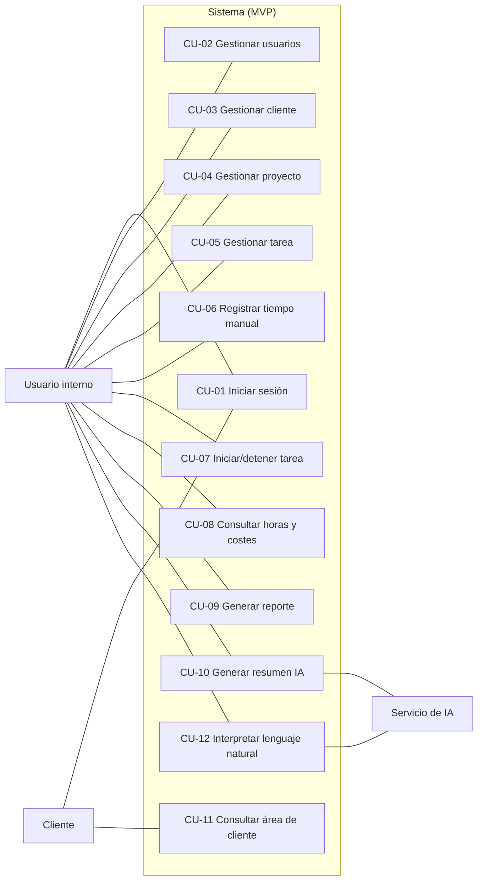
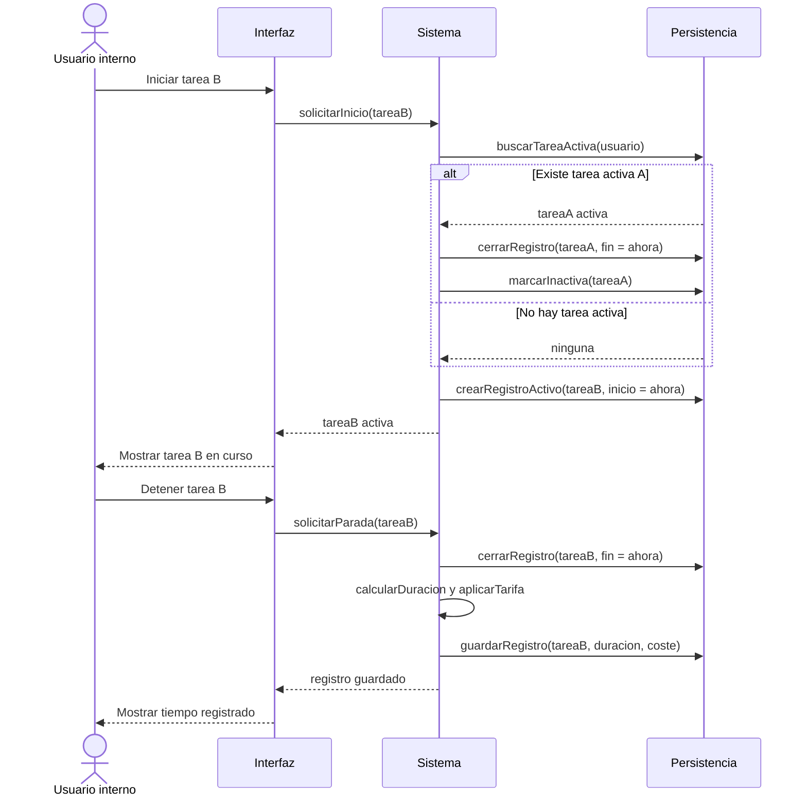
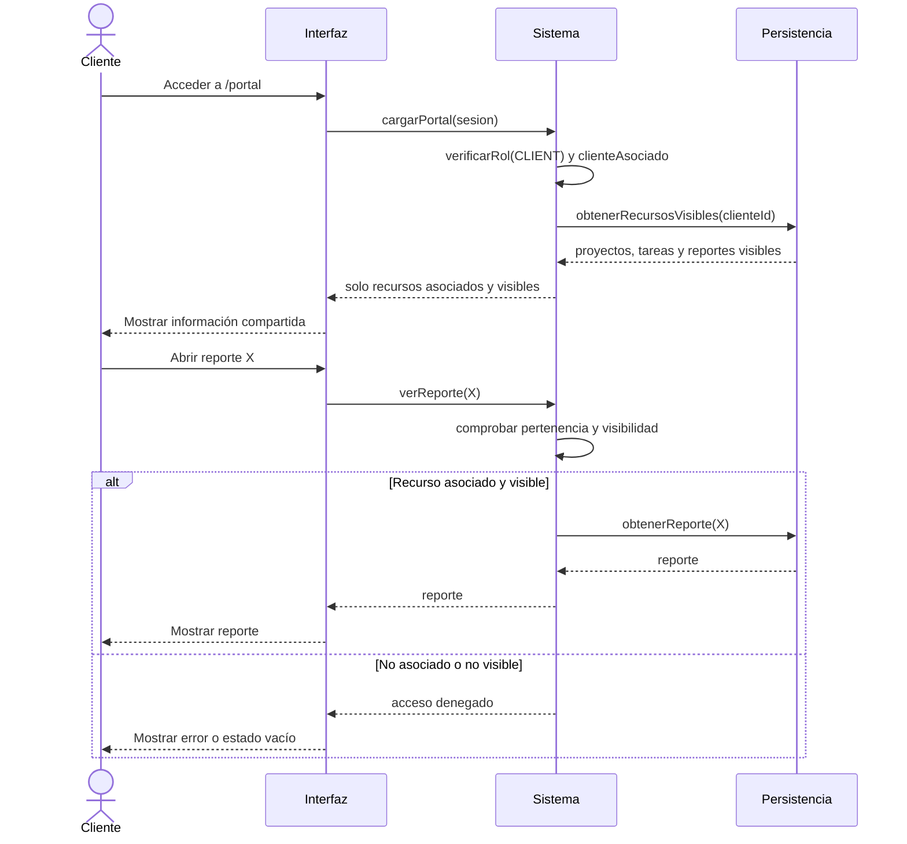

# Diagramas UML

> Documento funcional del MVP del TFM.
> Reúne los diagramas UML del sistema: diagrama de casos de uso y diagramas de secuencia de los flujos con lógica destacable.

## 1. Introducción

Este documento aporta una vista UML del MVP que complementa los casos de uso (`docs/10-casos-de-uso.md`) y la definición de pantallas (`docs/11-pantallas-y-navegacion.md`).

Los diagramas se expresan en Mermaid para mantenerlos versionables dentro del repositorio. No describen detalles de implementación técnica (clases, persistencia, infraestructura), que corresponden a `docs/04-arquitectura.md`.

Los diagramas reflejan el comportamiento objetivo del MVP. El estado real de implementación de cada caso de uso se mantiene en `docs/10-casos-de-uso.md` y `docs/11-pantallas-y-navegacion.md`, y no se duplica aquí para evitar incoherencias.

## 2. Diagrama de casos de uso

Relaciona los actores con los casos de uso del MVP. Mermaid no dispone de un tipo nativo de diagrama de casos de uso UML, por lo que se representa como grafo con una frontera de sistema.



> Notas de relaciones:
> - CU-10 y CU-12 usan el servicio de IA como actor de apoyo; el resultado siempre es revisable por el usuario interno (RN-18, RN-19).
> - CU-07 incluye la prevención de solapamiento descrita en la sección 3.1.

## 3. Diagramas de secuencia

### 3.1. Iniciar y detener tarea con prevención de solapamiento (CU-07)

Demuestra la regla RN-12: un usuario interno solo puede tener una tarea activa; al iniciar otra, la anterior se detiene antes.



### 3.2. Generar reporte con resumen asistido por IA (CU-09, CU-10)

Demuestra que la IA actúa como apoyo revisable y que el reporte sigue siendo usable aunque la IA falle (RN-18, RN-19, RN-22).

```mermaid
sequenceDiagram
  actor U as Usuario interno
  participant UI as Interfaz
  participant S as Sistema
  participant DB as Persistencia
  participant IA as Servicio de IA

  U->>UI: Generar reporte (cliente, proyecto?, periodo)
  UI->>S: generarReporte(filtros)
  S->>DB: obtenerTareasYTiempos(filtros)
  DB-->>S: datos del periodo
  S->>S: calcularTotalHoras y costeEstimado
  S->>DB: crearReporte(estado = BORRADOR)
  S-->>UI: reporte en borrador

  U->>UI: Solicitar resumen IA
  UI->>S: solicitarResumen(reporte)
  S->>IA: generarResumen(datosMinimos)
  alt IA responde
    IA-->>S: texto propuesto
    S->>DB: registrarUsoIA(estado = GENERADO)
    S-->>UI: propuesta revisable
    U->>UI: Revisar y aceptar/ajustar
    UI->>S: guardarResumen(reporte, textoRevisado)
    S->>DB: actualizarReporte(aiSummary)
  else IA no disponible o error
    IA-->>S: error
    S->>DB: registrarUsoIA(estado = ERROR)
    S-->>UI: aviso; reporte sigue usable sin resumen
  end
  UI-->>U: Reporte consultable
```

### 3.3. Consulta restringida como cliente (CU-11)

Demuestra el control de visibilidad: el cliente solo accede a información asociada a su cliente y marcada como visible (RN-02, RN-17, RN-20, RN-21).



## 4. Trazabilidad

| Diagrama | Casos de uso | Reglas destacadas |
|---|---|---|
| 2. Casos de uso | CU-01 … CU-12 | RN-18, RN-19 |
| 3.1. Start/stop | CU-07 | RN-10, RN-11, RN-12, RN-13 |
| 3.2. Reporte con IA | CU-09, CU-10 | RN-15, RN-18, RN-19, RN-22 |
| 3.3. Consulta cliente | CU-11 | RN-02, RN-17, RN-20, RN-21 |
